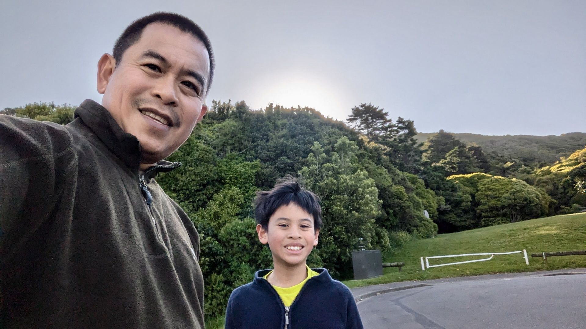
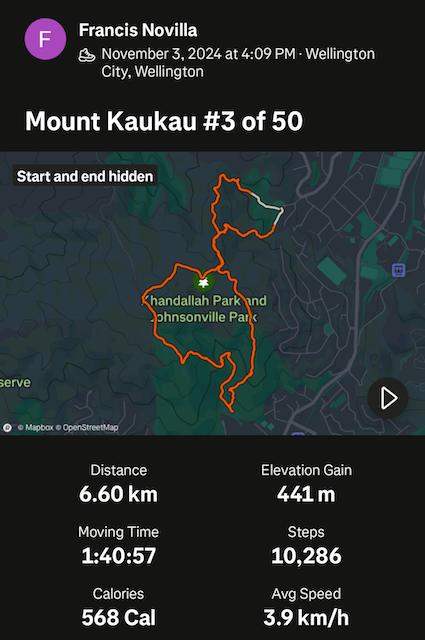
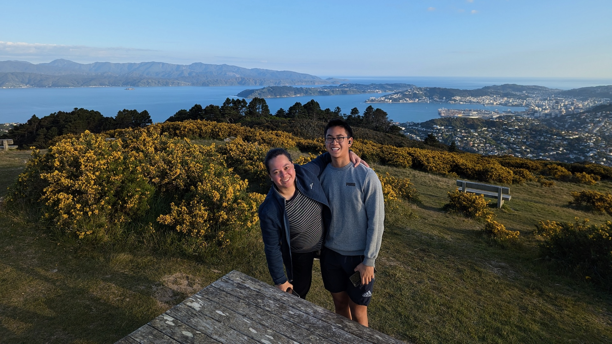
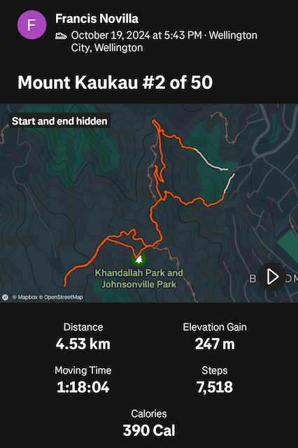
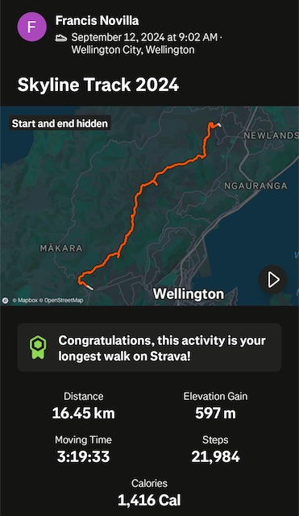

# Mount Kaukau 50 at 50

## #3 of 50 - November 3, 2024

Lovely walk up with Liam. Started at Truscott Ave, then up the Northern Walkway. Instead of going straight up to the
summit, we took left on the saddle towards Sirsi Terrace and followed a small track down to the Khandallah pool
playground.
Got a bit worried encountering a huge fallen tree way down the track, fearing we'd have to backtrack up. We followed
another sidetrack which thankfully led straight to the grassy area near the playground. Phew! From there, we walked up
the regular route to the summit then back down to Truscott Ave.
The wind had quite a bite to it at the top, but the sun was shining and the views were great. A good day out.

{: width="5%"}

## #2 of 50 - October 19, 2024

From Truscott Ave, straight up to the summit and back down. This one with Grace and Ryan :)

## #1 of 50 - September 12, 2024

Skyline Track from Old Coach Road in Johnsonville all the way to Makara Road in Karori. Started after school dropoff and
finished around 1pm. Grace picked me up at Karori Park and we then had a hearty lunch at La Cloche!

